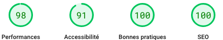

# [Personal Portfolio](https://jonathan.pl) 🎨

## 🚀 2024 Update

v4 of my personal portfolio using [Astro](https://astro.build/) is now [live](https://jonathan.pl)!

Migration from 2020 Nuxt 2 reaching [End of Life](https://v2.nuxt.com/lts) was the opportunity to try [Astro](https://astro.build/).

I’m very happy with the result, achieving an impressive size reduction:

v3 (248.71 kB)
```text
/index.html (24,53 kB)
├── 6d9de06.js (2,37 kB)
├── 8182508.js (172.05 kB)
├── 766eaf8.js (60.26 kB)
├── 92ce22e.js (16.51 kB)
├── 0b849bb.js (9.53 kB)
```

v4 (11,83 kB)
```text
/index.html (11,83 kB)
```
With all JS and CSS inlined.

And of course [Lighthouse](https://developer.chrome.com/docs/lighthouse/overview/) score increased:

v3


v4



One of the challenges was to re-create [Nuxt Color Mode](https://color-mode.nuxtjs.org/) with vanilla JS and CSS. 


With the help of the [Astro docs](https://docs.astro.build/en/tutorial/6-islands/2/), the result was very neat, you can check the component [Switch.astro](./src/components/Switch.astro)

On the other hand, I chose to abandon the [Vue Transition Component](https://vuejs.org/guide/built-ins/transition) to avoid introducing a JS framework in the project.

## 🦕 History

- [v4](https://github.com/flibustier/portfolio/tree/v4) 2024 [Astro](https://astro.build/) (SSR) custom CSS + JS  
- [v3](https://github.com/flibustier/portfolio/tree/v3) 2020 [Nuxt 2](https://nuxt.com/) (SSR) + Vue 2 + SCSS
- [v2](https://github.com/flibustier/portfolio/tree/v2) 2018 [Phenomic](https://github.com/MoOx/phenomic)
- v1 Static HTML + CSS

## 🧑‍🎨 Project Structure

Inside of the Astro project, you'll see the following folders and files:

```text
/
├── public/
│   └── icons/
│   └── images/
├── src/
│   ├── components/
│   │   └── Card.astro
│   ├── layouts/
│   │   └── Layout.astro
│   └── pages/
│       └── index.astro
└── package.json
```

Astro looks for `.astro` or `.md` files in the `src/pages/` directory. Each page is exposed as a route based on its file name.

There's nothing special about `src/components/`, but that's where we like to put any Astro/React/Vue/Svelte/Preact components.

Any static assets, like images, can be placed in the `public/` directory.

## 🧞 Commands

All commands are run from the root of the project, from a terminal:

| Command                   | Action                                           |
| :------------------------ | :----------------------------------------------- |
| `npm install`             | Installs dependencies                            |
| `npm run dev`             | Starts local dev server at `localhost:4321`      |
| `npm run build`           | Build your production site to `./dist/`          |
| `npm run preview`         | Preview your build locally, before deploying     |
| `npm run astro ...`       | Run CLI commands like `astro add`, `astro check` |
| `npm run astro -- --help` | Get help using the Astro CLI                     |
